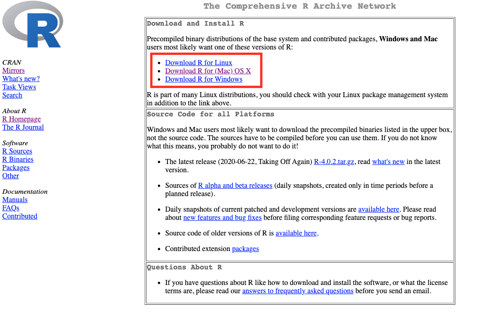

```{r setup, include=FALSE, warning = FALSE, message = FALSE}
knitr::opts_chunk$set(echo = FALSE)
library(dplyr)
library(flextable)
```

## R and Rstudio installation

This module is an introduction to using the R software through the Rstudio interface.
R is both a computer software and a programming language that can be used for powerful data analysis and will be used across several of the taught modules that you will undertake.

Campus computers have the software installed and when working from home/off campus you can access it through the windows virtual desktop [WVD Client](https://services.ncl.ac.uk/itservice/core-services/software/wvd/#accesswvd).
R and Rstudio are free software that you can download and run on your computer (it is compatible with Windows, Mac and Linux).
To get set up with the software on your machine follow these  steps

1. You can [download the R software](https://cran.r-project.org/) by selecting your operating system and downloading the latest release.

```{r r-download, width=8, echo = FALSE}



```


2. [Download the Rstudio desktop software](https://rstudio.com/products/rstudio/#rstudio-desktop) Choosing the free open source edition.

```{r rstudio-download, width=8, echo= FALSE}

knitr::include_graphics("images/Rstudio-download-ref.png")

```

Once both R and Rstudio have been downloaded and installed on your machine you can get to work

## Navigating Rstudio

On opening Rstudio you should see something like this

```{r}
knitr::include_graphics("images/Rstudiofresh.png")
```

In the top left click `file` > `new file` > `R script` and now you should have four windows that look something like this:

```{r}
knitr::include_graphics("images/Rstudio4packages.png")

```


You should now have Four panes in your Rstudio window, you might notice that some of them have multiple tabs as well. Let's run through the meaning of each of the panes, and the tabs that we are going to be using:

### Scripts
 The pane in the **top left** contains your scripts, scripts are files that contain code, most often you will be working with files that have the .R extension, these are files that your comuter recognises as containing R code. 
One of the key reasons that R is so popular is because it allows us to make our work reproducible.
By writing down each bit of our analysis and saving it in a script we can reproduce our work with ease. 
Future you will be thank past you for saving your code in scripts when you are making last minute edits to your dissertation and you need to remember exactly what the analysis methods you used were.

### Environment
 The pane in the **top right** has a couple of tabs but the one that we need to know about is the Environment tab.
The Environment pane tells us what objects R has loaded in to its memory, these might be data files that we have imported or the results of some analyses. 
This pane shows us the objects that R has available for doing useful stuff.

### Console
The pane in the **bottom left** also has several tabs and the one that we use is called the console.
This pane is the 'doing pane' when we want to run bits f code that we have saved in our script we send them to the console to be executed - which means R does what our code tells it to do.
You might see people typing code directly in to the console and while this is possible it is not advisable.

### Files/Plots/Packages

**Bottom right pane** has several tabs that give the pane different functions that can be of use. 

The ***Files*** tab can be used  a bit like windows explorer/finder to navigate through the files on your computer.
```{r, fig.cap = " Here the files tab shows us that within the folder that we are working in there are several different files associated with the module handbook as well as a folder of images"}
knitr::include_graphics("images/Rstudio4files.png")
```

The ***Plots*** tab is where the plots that you create using the code written in your script will appear. 
It has an export button that you can use to save your plots or to copy them to your clipborad so that you can then insert them into documents or presentations.

The ***Packages*** tab shows you the packages that are installed on your computer, the ones with ticks in the boxes are ones that are loaded and ready for you to use.
Packages are collections of code that other people have written that we can use.

```{r, fig.cap="You can see here that there are several packages that are installed with the R software and some pacages like the base package are already loaded and ready to use"}
knitr::include_graphics("images/Rstudio4packages.png")
```

```{r, message =FALSE, warning= FALSE}

p <- paste("When working through tutorials you might find examples of functions being noted to belong to a package. eg. we're going to use the `read_csv` function (", emo::ji("package"),"readr)")
p <- as.data.frame(p)
names(p) <- paste("A note on packages", emo::ji("package"))

myft <- flextable(p) %>% 
 bg(., bg = "#9cdce6", part = "header") %>% 
bg(bg = "#9cdce6", part = "body") %>% 
align(align = "center", part = "all") %>% 
set_table_properties(width = 1, layout = "autofit")
myft
```


<!-- A note on packages `r emo::ji("package")`  -->

<!-- When working through tutorials you might find examples of functions being noted to belong to a package. eg. we're going to use the `read_csv` function (`r emo::ji("package")`  readr) -->

Students often ask "how do you remember which functions to use" and "which functions are in each package" the answer is that it is experience, the more you come to use R the more of the code you remember.
The good news is that you don't necessarily need to memorise which package a particular function belongs to but knowing can help with troubleshooting issues, the most common being that R doesn't recognise a function when the package that function belongs to hasn't been loaded. 

The ***Help*** tab offers you an interactive window through which you can use the help files for R functions.
You can use the search bar at the top of the pane to search for the help files associated with a given package or function.

```{r}
knitr::include_graphics("images/Rstudio4help.png")
```

- a note about using the help files, their structure , what they show 

The ***Viewer*** tab can be used to look at interactive files such as animated plots or the tutorials that we are working through...if tutorials are being hosted in the package???

#### Think of R as your Kitchen

Using R can be thought of similar to using a kitchen to cook.

```{r, fig.align='center'}
knitr::include_graphics("images/Rkitchen.png")
```

There are loads of really great chefs (coders) in the world who have already figured out a lot of techniques and gadgets that can be used to make some great food.

```{r, fig.align='center'}
knitr::include_graphics("images/cookr.jpg")
```

You don't always have to cook everything from scratch - you can use the information and tools that other people have provided to make your cooking experience easier and more enjoyable 


FYI: you can change the default location of the panes, among many other things: [Customizing RStudio](https://support.rstudio.com/hc/en-us/articles/200549016-Customizing-RStudio)


## Projects `r emo::ji("file_cabinet")` 

<!-- When we are working on something in R it is good to keep all of the files associated with that work together in one place. -->
<!-- Not only is this good practice but it can help us to help you (if you get stuck) and can save you from having to work with unnecessairily long file paths which makes life easier. -->
<!-- What do we mean by the term 'file path'?  -->


To load information from files in to R we need to tell R exactly where on our computer that file is.
The file path is the information that denotes where on your computer a file is stored.
Often file paths are specific to your computer or to your username and might look something like this: 

```{r, eval = FALSE, echo = TRUE}

"C:/Users/Myusername/Documents/Uniwork/mydataforbio2020.xlsx"

```

This tells us that "mydata.xlsx" is in the `r emo::ji("file_folder")`Uniwork, which is in the `r emo::ji("file_folder")` Documents on my computer.

The file path for a specific file will almost always be different on different peoples computers (depending on which folder you saved a file in for example) and this can cause confusion when we are trying to run our code or asking a friend to check our code. 

We can minimise the issues with this by using the [Projects](https://support.rstudio.com/hc/en-us/articles/200526207-Using-Projects) option that is built in to RStudio.
When we create a Project RStudio will create a file with the extension `.Proj` which basically tells R to start looking for files from the folder that we are in. 

It is good practice to have a seperate RStudio project for each project that you are working on so it would be a good idea to have a seperate Project for each of the modules that you use R for and a project for your dissertation work.

#### Setting up a Project

To create a new project go to the projects menu, either by clicking the dropdown in the top right hand side of your window (next to where it says Project: (None)) or by clicking `File` > `New Project`  

You should now see this popup window: 

```{r}
knitr::include_graphics("http://www.rstudio.com/images/docs/projects_new.png")
```

Select `New directory`  then  `New Project`

Give your project a name (eg. the name of the module) and select where on your computer you want that to live.
Click `Create project` and you should now see the name of your project displayed in the top right hand side of your RStudio window. 

**NB** If you are an organised person and you had already created a folder for all of the work associated with a given module you can select `Existing Directory` navigate to your already existing folder and then select create project and the `.RProj` file will live in that folder alongside all your other files


When you work in a Project R knows to look within that project folder for any files that you want to access.
Now that you are working in a project the Files tab (bottom right window) will default to displaying the files that are in your project folder.

`r emo::ji("file_cabinet")` How you organise your files within the project folder is up to you, there are some good tips in this [guide](https://www.britishecologicalsociety.org/wp-content/uploads/2017/12/guide-to-reproducible-code.pdf) produced by the [British Ecological Society](https://www.britishecologicalsociety.org/)

We suggest that you have a couple of subfolders to keep you organised

 + `r emo::ji("file_folder")` Data, where all of your data files live
 + `r emo::ji("file_folder")`Analysis, where you can store all of your scripts
 
When working in a project you can access your data files using a shorter file path 

```{r, eval = FALSE, echo = TRUE}

"Data/mydataforbio2020.xlsx"

```
rather than 
```{r, eval = FALSE, echo = TRUE}

"C:/Users/Myusername/Documents/Uniwork/BIO2020/Data/mydataforbio2020.xlsx"

```


```{r}

```

## Working with data

- objects
- functions
- data types, character, numeric
- data structures, vector ,matrix, data frame/tibble

## Importing and exporting data

To be able to analyse our data in R we first have to import/read it in to R so that it is available to us in our environment (Taking it out of the cupboard and placing it on the counter).
How we go about this varies slightly depending on the file that we are going to be using.
In all cases we need to assign the information in the file to an object so our code will start with the name of the object we are creating and the `<-` symbol

#### `r emo::ji("file_folder")`CSV

Often data are stored in a `.csv` file a specific file type that is commonly used, these files look just like excel files (you can open them up and look at them in excel) they are just read differently by the computer.
You will likely see two different ways of reading these files in to R using either the `read.csv()` function or the `read_csv()` function (`r emo::ji("package")` readr).
These functions essentially do the same thing (get your data in to R) but with some slight differences that we will address later on.

```{r, eval = FALSE, echo = TRUE}
my_data_object <- read.csv(path = "Path_to_the_file.csv")

my_data_object <- read_csv(path = "Path_to_the_file.csv")
```

#### `r emo::ji("file_folder")` Excel 

Using the `read_excel()` function (`r emo::ji("package")` reaxl) you can import information from excel files (`.xlsx` and `.xls`) containing multiple sheets. 
By default the function will read the information from the first sheet unless you specify the name of the sheet that you want. 

```{r, eval = FALSE, echo = TRUE}
my_data_object <- read_excel(path = "Path to the file.xlsx", sheet = "name of sheet")
```

### Saving outputs

#### Saving data objects `r emo::ji("1234")`
Once we have manipulated our data we may want to save it as a file that we can then share with others. 
Data can be saved to `.csv` files using either the `write.csv` function or the `write_csv` function (`r emo::ji("package")` readr).

The code is similar to that used to read data in, it requires the filepath specifying where you want to save the file which includes the name that you want to give to the file, and it requires the name of the object that is being written (saved).

```{r, eval = FALSE, echo = TRUE}
# writing my_data_object to a file called my_output_data

write.csv(my_data_object, path = "Data/my_output_data.csv")

write_csv(my_data_object, path = "Data/my_output_data.csv")
```


#### Saving plots `r emo::ji("framed_picture")`

Once you have created your beautiful plots that support your analysis you will want to be able to copy them into your reports. 
The easiest way to do this is to use the dropdown `Export` menu in the plots pane. 

You can copy plots to the clipboard or save them as a file (specifying the file type, .png/.jpg/.tiff etc.)

The popup preivew that appears when you choose to copy a plot to the clipboard or to save it as an image allows you to specify the size that you want the image to be.
Altering the size of your plot here will give you a much clearer plot than if you resize a copied or saved plot after adding it to your destination document. 

```{r}
knitr::include_graphics("images/plot_popup.png")
```

You can specify the image size using the numbers or you can grab the plot by the triangle in the bottom right corner of the preivew pane and drag the plot to the desired size. 

## Basic manipulations
- selecting
- filtering

## Plotting 

## Getting help

- using the help function
- googleing your error message 

## Further resources
